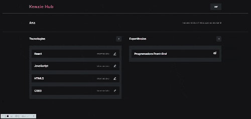

<h1>💻 KENZIEHUB</h1>

 

O Kenziehub é uma aplicação voltada para pessoas desenvolvedoras, para que possam guardar seu histórico de habilidades e de atuação profissional. O usuário pode visualizar, cadastrar, editar e excluir skills e experiências. Também, a aplicação conta com diversos modais de erro e sucesso com a finalidade de deixar mais fluída sua utilização pelo usuário.
 

<h1>🔨 RECURSOS</h1>

<ul>
<li><strong>Cadastro:</strong> para utilizar a aplicação é necessário realizar cadastro.</li>
<li><strong>Login:</strong> o usuário cadastrado pode realizar login.</li>
<li><strong>Logout:</strong> o usuário cadastrado pode sair da aplicação.</li>
<li><strong>Perfil:</strong> o usuário logado pode visualizar as tecnologias e experiências cadastradas.</li>
<li><strong>Cadastro de tecnologias:</strong> o usuário pode cadastrar suas tecnologias.</li>
<li><strong>Cadastro de experiências:</strong> o usuário pode cadastrar suas experiências profissionais.</li>
<li><strong>Edição de tecnologias:</strong> o usuário pode editar suas tecnologias.</li>
<li><strong>Edição de experiências:</strong> o usuário pode editar suas experiências profissionais.</li>
<li><strong>Alertas:</strong> o usuário é informado, através de modais, se as suas requisições tiveram ou não sucesso.</li>
<li><strong>Aplicação responsiva</strong></li>
</ul> 

<h1>🚀 TECNOLOGIAS</h1>

<ul>
<li>TYPESCRIPT</li>
<li>JAVASCRIPT</li>
<li>HTML</li>
<li>CCS</li>
<li>REACT</li>
<li>CONTEXT-API</li>
<li>REACT-ROUTER-DOM</li>
<li>CONSUMO DE API REST</li>
<li>AXIOS</li>
<li>REACT-HOOK-FORM</li>
<li>YUP VALIDATION</li>
<li>TOASTIFY</li>
<li>FRAME-MOTION</li>
<li>STYLED-COMPONENTS</li>

</ul> 

<h1>🔗 LINK</h1>

<a href="https://react-entrega-s2-formulario-de-cadastro-elizeu-vasconcelos1992.vercel.app/" target="_blank">LINK PARA O KENZIEHUB</a>
